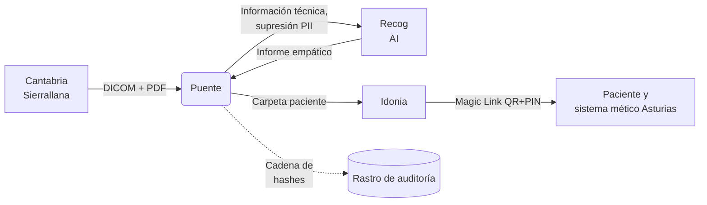

<div align="center">

# Puente Idonia-Recog
    
**Cuando los Picos de Europa separan al paciente de su historia clínica, los datos deben cruzar la montaña antes que él.**

[](https://www.python.org/)
[](https://github.com/astral-sh/ruff)
[](https://github.com/microsoft/pyright)

</div>

Presentamos un orquestador asíncrono que conecta **Idonia** (middleware de imagen médica) y **Recog** (IA de lenguaje natural) para resolver un problema real: la portabilidad de datos entre las comunidades autónomas en zonas rurales limítrofes entre comunidades autónomas.

Proyecto desarrollado para el **I Hackathon IABIOMED**.

### El problema a solucionar

Un montañero de Panes (Asturias) sufre una lesión de rodilla en los Picos de Europa. Por orografía, el hospital de referencia más cercano está en **Sierrallana (Cantabria)**, no en Arriondas. Le operan, le hacen resonancia antes y después, y vuelve a casa.

Una semana después, su médico de cabecera en Asturias **no tiene acceso ni a las imágenes ni al informe quirúrgico**. El protocolo de colaboración entre comunidades existe, pero los datos no viajan.

Este proyecto resuelve ese flujo de extremo a extremo.

---

## La solución



### Fase I — Ingesta (Interoperabilidad)
- Recepción simulada desde Cantabria
- Creación de carpeta de paciente en Idonia indexada por DNI
- Subida del DICOM y del PDF del informe quirúrgico

### Fase II — Humanización
- **Capa de redacción PII/PHI** previa al envío a Recog (DNI, NHC, nombres, fechas) usando reglas específicas para identificadores españoles
- Invocación de Recog para adaptar el informe a lenguaje empático y comprensible
- Reinyección del informe humanizado en Idonia como `Informe para paciente`

### Fase III — Entrega (Magic Link)
- Generación de enlace seguro QR + PIN
- Acceso unificado a imagen, informe clínico e informe humanizado

### En todo momento
- Trazabilidad verificable de cada acceso y operación en el rastro de auditoría
- Observabilidad de toda operación extremo a extremo mediante telemetría

---

## Ejecución

```bash
# Demostración extremo a extremo
make demo
# Despliegue
make up
# Pruebas
make check
make test
make test --fast
```

Visor disponible en el Magic Link impreso al final de `make demo`.

---

## Lo que hace este proyecto distinto

- **Registro de auditoría con cadena de hashes** — cada acción verificable mediante encadenamiento de firmadas criptográficas. Protección de integridad por diseño. → [`src/puente/audit/`](./src/puente/audit/)
- **Redacción de PII antes de salir a terceros** — el informe se anonimiza antes de llegar a Recog. → [`src/puente/adapters/redaction.py`](./src/puente/adapters/redaction.py)
- **Observabilidad OpenTelemetry de extremo a extremo** — Idonia → Puente → Recog → Idonia, cada paso observable. → [`src/puente/telemetry.py`](./src/puente/telemetry.py)
- **Arquitectura hexagonal** — dominio puro, adaptadores aislados, servicios reanudables. Tests unitarios sin red. → [`ARCHITECTURE.md`](./ARCHITECTURE.md)
- **Idempotencia por fase** — si Recog cae a mitad, reintentas sin duplicar. Backoff exponencial con `tenacity`.
- **Doble superficie** — API REST (FastAPI) y CLI (Typer + Rich) sobre el mismo núcleo.

---

## Modelo de seguridad

Dado que se manejan datos clínicos, este proyecto incluye:

- **Rastro de auditoría con integridad y no-repudio**: cada operación se firma y encadena por medio de un hash criptográfico
- **Redacción de PII antes de salir hacia terceros**: se minimiza la cantidad de información personalmente identificable (PII) que sale del puente, via una capa de saneamiento
- **Modelo de Amenaza documentado** (STRIDE)
- **Aislamiento del ejecutable**, por medio de imágenes Docker con usuario rootless
- **Observabilidad** de extremo a extremo

Para más información, véase [`SECURITY.md`](./SECURITY.md)

---

## Nuestro stack

| Capa | Tecnología |
|------|------------|
| Motor | Python 3.14 + asyncio |
| Gestor de paquetes | [uv](https://github.com/astral-sh/uv) |
| Arquitectura de servidor | [FastAPI](https://fastapi.tiangolo.com/) |
| Validación de datos | [Pydantic v2](https://pydantic.dev/docs/validation/latest/get-started/) |
| Cliente HTTP | [httpx](https://www.python-httpx.org/) + [tenacity](https://tenacity.readthedocs.io/) (lógica inteligente de reintentos) |
| Protección de PII/PHI | [Presidio](https://microsoft.github.io/presidio/) |
| Persistencia | [SQLite](https://sqlite.org/) (rastro de auditoría) |
| Observabilidad | [structlog](https://www.structlog.org/) + [OpenTelemetry](https://opentelemetry.io/) |
| Tests | [pytest](https://docs.pytest.org/) + [pytest-asyncio](https://pytest-asyncio.readthedocs.io/) + [respx](https://lundberg.github.io/respx/) |
| Control de calidad | [ruff](https://github.com/astral-sh/ruff) + [pyright](https://github.com/microsoft/pyright) |
| CI | [GitHub Actions](https://github.com/features/actions) |
| Ejecución | [Typer](https://typer.tiangolo.com/) + [Rich](https://github.com/textualize/rich) CLI + Make |
| Despliegue | [Docker Compose](https://docs.docker.com/compose/) (linux, distroless) |

---

## Estructura del proyecto

```
README.md
ARCHITECTURE.md
SECURITY.md

Makefile
Dockerfile
docker-compose.yml

src/puente/
├── domain/      # Modelos puros, sin I/O
├── services/    # Casos de uso: ingest, humanize, deliver
├── adapters/    # Idonia, Recog, redacción PII
├── audit/       # Log con rastro de auditoría
├── api/         # FastAPI
└── cli/         # Typer + Rich

tests/
scripts/

```

---

## Equipo

- **Sergio Díaz Esparza** — Arquitectura e implementación
- **Marina Dáder Suárez** — Diseño, documentación, comunicación y coordinación

---

## Licencia

Los autores se reservan los derechos sobre el trabajo, de acuerdo con las bases del Hackathon.
